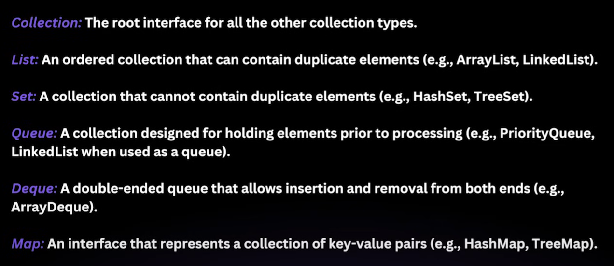
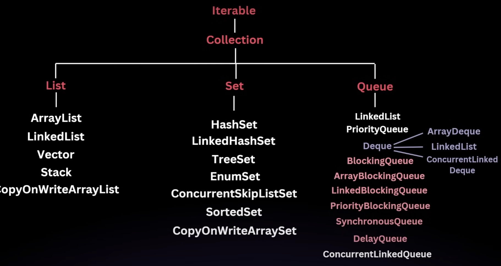

# Java Collections Framework & Streams
- 📚 [Collection Framework](#collection-framework)
- 📝 [List Interface](#list-interface)
  - 📦 [Internal Working of ArrayList](#internal-working-of-arraylist)
- ⚖️ [Comparator](#comparator)
- 🧵 [Vector](#vector)
- 🧱 [Stack](#stack)
- 🌳 [Tree](#tree)
- 🌲 [Binary Tree](#binary-tree)
- 🌿 [Binary Search Tree (BST)](#binary-search-tree-bst)
- 🌾 [AVL Tree](#avl-tree)
- 🌐 [Trie](#trie)
- 🔺 [Heap](#heap)
- [☕ Java 8](#-java-8)
  - 🌿 [Lambda Expressions](#-lambda-expressions)
  - 🔧 [Functional Interfaces](#-functional-interfaces)
    - ✅ [Predicate](#-predicate)
    - 🧪 [BiPredicate](#-bipredicate)
    - 🔁 [Function](#-function)
    - 🔄 [BiFunction](#-bifunction)
    - 📦 [Consumer](#-consumer)
    - 📤 [BiConsumer](#-biconsumer)
    - 🛒 [Supplier](#-supplier)


## Collection Framework
A Collection Framework is a unified architecture in programming (notably Java, but the concept applies broadly) that provides a set of interfaces, classes, and algorithms to store, retrieve, and manipulate groups of objects efficiently.

### Key Points:
- Consists of interfaces (e.g., List, Set, Queue, Map) that define contracts for collection types.
- Includes classes (e.g., ArrayList, HashSet, PriorityQueue, HashMap) that implement these interfaces.
- Comes with algorithms (e.g., sorting, searching) that work across different types of collections.
- Promotes reusability and interoperability since all collection classes follow a standard API.
- Reduces coding effort — no need to reinvent data structures from scratch.
Example (Java):
```java
import java.util.*;

public class Main {
public static void main(String[] args) {
List<String> list = new ArrayList<>();
list.add("Apple");
list.add("Banana");
list.add("Cherry");

        Collections.sort(list); // Sorting using built-in algorithm
        System.out.println(list); // [Apple, Banana, Cherry]
    }
}
```
### Use cases:
- Storing data with dynamic size.
- Performing complex operations (search, sort, shuffle) with minimal code.
- Switching between different data structures without rewriting business logic.



## List Interface

- Definition:
  The List Interface in the Collection Framework is an ordered collection (also known as a sequence) that allows duplicate elements and provides positional (index-based) access to elements.
- Key Points:
  - Maintains insertion order.
  - Allows duplicate elements.
  - Elements can be accessed by their index (starting at 0).
  - Supports iteration in both forward and backward directions (via ListIterator).
  - Common implementations:
    - Java: ArrayList, LinkedList, Vector, Stack.
```java
import java.util.*;

public class Main {
    public static void main(String[] args) {
        List<String> fruits = new ArrayList<>();
        fruits.add("Apple");
        fruits.add("Banana");
        fruits.add("Apple"); // duplicates allowed

        System.out.println(fruits.get(1)); // Banana
    }
}
```
- Use cases:
  - When you need an ordered collection with possible duplicates.
  - For positional access and modification.
  - Useful in scenarios like task lists, ordered playlists, and sequence-based operations.

## Internal Working of ArrayList

### Definition:
  ArrayList is a resizable array implementation of the List interface in Java. Internally, it uses a dynamic array to store elements and automatically manages its capacity.

Key Points (How it works internally)
- Underlying Data Structure:
  - Backed by a Object[] array.
- Default Capacity:
  - Starts with a default size (Java 8: 10).
- Resizing Mechanism:
  - When the array is full and a new element is added, ArrayList creates a new array with 1.5× the old capacity (newCapacity = oldCapacity + oldCapacity/2) and copies old elements into it.
- Index-Based Access:
  - Allows O(1) time complexity for get() and set() because it uses direct index access on the underlying array.
- Insertion:
  - Adding at the end: Amortized O(1).
  - Adding in the middle: O(n) because elements after the position must be shifted.
- Removal:
  - After removing an element, all subsequent elements are shifted left to fill the gap. This is O(n).
- Null Elements:
  - Can store null values.
- Thread Safety:
  - Not synchronized — must be manually synchronized for multi-threaded environments using Collections.synchronizedList().

## Comparator

#### Definition:
  Comparator is an interface in Java used to define custom ordering logic for objects. It allows sorting based on fields/properties without changing the object’s natural ordering defined by Comparable.
- Key Points:
  - Found in java.util package.
  - Functional interface → can be implemented with lambda expressions (Java 8+).
  - Has one main method:
    ```java  
    int compare(T o1, T o2);
    ```
- Returns:
  - Negative → o1 is “less than” o2
  - Zero → equal
  - Positive → o1 is “greater than” o2
- Allows multiple sorting strategies without modifying the class.
- Works with sorting methods like Collections.sort() and List.sort().
```java
import java.util.*;

class Student {
    String name;
    int marks;
    Student(String name, int marks) {
        this.name = name;
        this.marks = marks;
    }
    public String toString() {
        return name + " - " + marks;
    }
}

public class Main {
    public static void main(String[] args) {
        List<Student> students = Arrays.asList(
            new Student("Amit", 85),
            new Student("Bhavna", 92),
            new Student("Charan", 78)
        );

        // Sorting by marks (descending)
        Comparator<Student> byMarksDesc = (s1, s2) -> Integer.compare(s2.marks, s1.marks);
        students.sort(byMarksDesc);

        System.out.println(students);
    }
}
```


-   Use cases:
    - Sorting by different criteria without altering model classes.
    - Multi-level sorting (e.g., sort by name, then by marks).
    - Situations where natural ordering (Comparable) isn’t suitable.

## Vector
Definition:

Vector is a legacy class in Java that implements a growable array of objects, similar to ArrayList, but with built-in synchronization for thread safety.

### Key Points
- Part of  package.
- Implements , , , and .
- Thread-safe → all methods are synchronized.
- Slower than  in single-threaded environments due to locking overhead.
- Automatically resizes when capacity is exceeded (like ).
- Default growth: doubles capacity when full (vs.  which grows by 50%).

```java
import java.util.*;

public class Main {
    public static void main(String[] args) {
        Vector<String> vector = new Vector<>();
        vector.add("Apple");
        vector.add("Banana");
        vector.add("Cherry");

        System.out.println(vector); // [Apple, Banana, Cherry]
    }
}
```
Use Cases
- When you need a thread-safe dynamic array and don’t want to manually synchronize an ArrayList.
- Legacy systems or APIs that still use Vector.
- Rarely used in modern code — prefer ArrayList + Collections.synchronizedList() or CopyOnWriteArrayList.

### ⏱️ Time Complexities

| Operation         | Time Complexity |
|------------------|-----------------|
| Access by index  | O(1)            |
| Insert at end    | Amortized O(1)  |
| Insert at middle | O(n)            |
| Delete by index  | O(n)            |
| Search           | O(n)            |

## Stack
- Definition:
  A Stack is a linear data structure that follows the LIFO (Last In, First Out) principle  the last element added is the first one to be removed.

Key Points
  - Java provides a Stack class in java.util (extends Vector).
- Common operations:
  - push() → add element to top
  - pop() → remove and return top element
  - peek() → view top element without removing
  - isEmpty() → check if stack is empty
  - search() → find position of element from top (1-based index)
- Can also implement stack using Deque (ArrayDeque) for better performance.

Example (Java)
```java
import java.util.*;

public class Main {
    public static void main(String[] args) {
        Stack<String> stack = new Stack<>();
        stack.push("A");
        stack.push("B");
        stack.push("C");

        System.out.println(stack.peek()); // C
        System.out.println(stack.pop());  // C
        System.out.println(stack);        // [A, B]
    }
}
```


⏱️ Time Complexities

| Operation   | Time Complexity |
|-------------|-----------------|
| push        | O(1)            |
| pop         | O(1)            |
| peek        | O(1)            |
| search      | O(n)            |
| isEmpty     | O(1)            |


Use Cases
- Undo functionality in editors.
- Expression evaluation (infix → postfix).
- Backtracking algorithms (DFS, recursion).
- Browser history navigation.


## Tree

- Definition:
  A Tree is a hierarchical data structure consisting of nodes, where each node has a value and references to child nodes. It starts from a root node and branches out into subtrees.

Key Points
- Terminology:
  - Root: Topmost node.
  - Leaf: Node with no children.
  - Parent/Child: Relationship between connected nodes.
  - Subtree: Tree formed by a node and its descendants.
  - Height: Longest path from root to leaf.
  - Depth: Distance from root to a node.
- Types of Trees:
  - Binary Tree: Each node has ≤ 2 children.
  - Binary Search Tree (BST): Left child < root < right child.
  - Balanced Tree (e.g., AVL, Red-Black): Maintains height balance.
  - Heap: Complete binary tree with heap property.
  - Trie: Tree for prefix-based string storage.
  - N-ary Tree: Node can have N children.
- Traversal Techniques:
  - Inorder (LNR): Left → Node → Right
  - Preorder (NLR): Node → Left → Right
  - Postorder (LRN): Left → Right → Node
  - Level Order: Breadth-first using queue

Example (Binary Tree Node in Java)

```java
class TreeNode {
    int val;
    TreeNode left, right;
    TreeNode(int val) {
        this.val = val;
    }
}
```


⏱️ Time Complexities (Binary Search Tree)

| Operation   | Average Case | Worst Case |
|-------------|--------------|------------|
| Search      | O(log n)     | O(n)       |
| Insert      | O(log n)     | O(n)       |
| Delete      | O(log n)     | O(n)       |
| Traversal   | O(n)         | O(n)       |


Worst case occurs when the tree becomes skewed (like a linked list).


Use Cases
- Hierarchical data (e.g., file systems, org charts).
- Efficient searching and sorting (BST, AVL).
- Expression parsing (syntax trees).
- Auto-complete and dictionary (Trie).
- Priority queues (Heap).

## Binary Tree

- Definition:
  A Binary Tree is a tree data structure where each node has at most two children, referred to as left and right.

#### Key Properties
- Max children per node: 2
- Recursive structure: Each subtree is itself a binary tree
- Not necessarily ordered (unlike BST)

#### Types of Binary Trees
- Full Binary Tree: Every node has 0 or 2 children
- Perfect Binary Tree: All internal nodes have 2 children, and all leaves are at the same level
- Complete Binary Tree: All levels filled except possibly the last, filled left to right
- Skewed Tree: All nodes lean left or right (degenerates into a linked list)

Java Implementation

```java
class TreeNode {
    int val;
    TreeNode left, right;
    TreeNode(int val) {
        this.val = val;
    }
}
```
#### 🔁 Traversals

| Type        | Order               | Use Case                     |
|-------------|---------------------|------------------------------|
| Inorder     | Left → Node → Right | BST: Sorted order            |
| Preorder    | Node → Left → Right | Tree copy, prefix expression |
| Postorder   | Left → Right → Node | Tree deletion, postfix expr  |
| Level Order | BFS using queue     | Shortest path, layer view    |

#### Recursive Traversal Example (Inorder,preOrder,postOrder)

#### preOrder
```java
    void preOrder(Node root){
        if(root == null) return;
        System.out.print(root.data +" => ");
        preOrder(root.left);
        preOrder(root.right);
    }
```
#### inorder
```java
void inorder(TreeNode root) {
    if (root == null) return;
    inorder(root.left);
    System.out.print(root.val + " ");
    inorder(root.right);
}
```
#### postOrder
```java
    void postOrder(Node root)
    {
        if(root == null) return;
        postOrder(root.left);
        postOrder(root.right);
        System.out.print(root.data +" => ");
    }
```
#### levelOder
```java
    void levelOder(Node root)
    {
        if(root==null)
        {
            return ;
        }
        Queue<Node> q = new LinkedList<>();
        q.add(root);
        q.add(null);

        while(!q.isEmpty())
        {
            Node currNode = q.remove();
            if(currNode == null)
            {
                System.out.println();
                if(q.isEmpty())
                {
                    break;
                }else {
                    q.add(null);
                }
            }else{
                System.out.print(currNode.data+" ");
                if(currNode.left !=null)
                {
                    q.add(currNode.left);
                }
                if(currNode.right !=null)
                {
                    q.add(currNode.right);
                }
            }
        }
    }
```

#### example for sum of tree 
```java
int sumOfNode(Node root)
    {
        if(root == null) return 0;
        int leftSum = sumOfNode(root.left);
        int rightSum = sumOfNode(root.right);
        return leftSum + rightSum + root.data;
    }
```

#### ⏱️ Time & Space Complexity

| Operation            | Time Complexity      | Space Complexity |
|----------------------|----------------------|------------------|
| Traversal            | O(n)                 | O(h) (recursive) |
| Insert/Search/Delete | Depends on tree type |

h = height of tree. In worst case (skewed), h = n.

Use Cases
- Representing hierarchical structures
- Expression trees (Pre/Post/Inorder)
- Tree-based recursion problems
- Foundation for BST, AVL, Heap, etc.

## 🌿Binary Search Tree (BST)
- Definition:
  - A BST is a binary tree where each node follows the rule:
    left subtree < node < right subtree

✅ Properties
- Efficient search, insert, delete (avg O(log n))
- Inorder traversal gives sorted order
- Duplicates usually not allowed

#### 🔧 Java Implementation
```java
class TreeNode {
    int val;
    TreeNode left, right;
    TreeNode(int val) {
        this.val = val;
    }
}
```
#### 🔍 Search Operation
````java
boolean search(TreeNode root, int key) {
    if (root == null) return false;
    if (key == root.val) return true;
    return key < root.val ? search(root.left, key) : search(root.right, key);
}
````
#### ⏱️ Time Complexity
| Operation | Avg Case | Worst Case |
|-----------|----------|------------|
| Search    | O(log n) | O(n)       |
| Insert    | O(log n) | O(n)       |
| Delete    | O(log n) | O(n)       |

Worst case: skewed tree (like linked list)


## 🌾AVL Tree
- Definition:
  A self-balancing BST where the difference in height between left and right subtree (balance factor) is at most ±1.

🔁 Rotations
- Left Rotation
- Right Rotation
- Left-Right Rotation
- Right-Left Rotation

⚖️ Balance Factor
balanceFactor = height(left subtree) - height(right subtree)


⏱️ Time Complexity
| Operation | Time     |
|-----------|----------|
| Search    | O(log n) |
| Insert    | O(log n) |
| Delete    | O(log n) |


Always balanced → guarantees log(n) height


🌐 Trie
- Definition:
  A prefix tree used to store strings efficiently, especially for search and autocomplete.

📚 Properties
- Each node represents a character
- Paths from root to leaf form words
- Fast prefix lookup

🔧 Java Implementation
class TrieNode {
TrieNode[] children = new TrieNode[26];
boolean isEndOfWord = false;
}


🔍 Insert Operation
void insert(TrieNode root, String word) {
for (char c : word.toCharArray()) {
int idx = c - 'a';
if (root.children[idx] == null)
root.children[idx] = new TrieNode();
root = root.children[idx];
}
root.isEndOfWord = true;
}


⏱️ Time Complexity
| Operation | Time     |
|-----------|----------|
| Insert    | O(L)     |
| Search    | O(L)     |
| Prefix    | O(L)     |


L = length of word


🔺 Heap
- Definition:
  A complete binary tree that satisfies the heap property:
- Max Heap: Parent ≥ children
- Min Heap: Parent ≤ children

🔧 Java (Min Heap using PriorityQueue)
PriorityQueue<Integer> minHeap = new PriorityQueue<>();


🧮 Heapify Operation
void heapify(int[] arr, int n, int i) {
int smallest = i;
int left = 2*i + 1;
int right = 2*i + 2;

    if (left < n && arr[left] < arr[smallest]) smallest = left;
    if (right < n && arr[right] < arr[smallest]) smallest = right;

    if (smallest != i) {
        swap(arr, i, smallest);
        heapify(arr, n, smallest);
    }
}


⏱️ Time Complexity
| Operation | Time     |
|-----------|----------|
| Insert    | O(log n) |
| Delete    | O(log n) |
| Heapify   | O(log n) |
| BuildHeap | O(n)     |


🎯 Use Cases
- Priority queues
- Scheduling tasks
- Dijkstra’s algorithm
- Heap sort


# ☕ Java 8

## 🌿 Lambda Expressions
- Purpose: Enables functional-style programming with concise syntax.
- Syntax: (parameters) -> expression
- Example:
```
(a, b) -> a + b
```
- Use Case: Simplifies iteration, filtering, and event handling


## 🔧 Functional Interfaces
- Definition: Interfaces with a single abstract method (SAM).
- Examples: Runnable, Comparator, Predicate
- Annotation: @FunctionalInterface
- Use Case: Enables lambda expressions and method references.

## ✅ Predicate
#### Definition:
A Predicate<T> is a functional interface that takes one input and returns a boolean. Used for conditional checks.

#### Method
```java
boolean test(T t);
```
#### Example:

```
Predicate<Integer> isEven = x -> x % 2 == 0;
System.out.println(isEven.test(4)); // true
```
- Use Cases:
  - Filtering collections
  - Stream operations: .filter(predicate)
  - Conditional logic chaining: .and(), .or(), .negate()

## 🧪 BiPredicate
#### Definition:
 - A BiPredicate<T, U> takes two inputs and returns a boolean. Used for dual-parameter condition checks.
#### Method:
```java
boolean test(T t, U u);
```
#### Example:
````java
BiPredicate<String, Integer> isLongEnough = (str, len) -> str.length() >= len;
System.out.println(isLongEnough.test("Java", 4)); // true
````
#### Use Cases:
- Comparing two values
- Validating key-value pairs
- Stream filtering with two inputs


## 🔁 Function
#### Definition:
A Function<T, R> takes an input of type T and returns a result of type R. Used for data transformation.

#### Method:
```java
R apply(T t);
```
#### - Example:
```
Function<Integer, Integer> square = x -> x * x;
System.out.println(square.apply(5)); // 25
```
- Use Cases:
  - Mapping values in streams: .map(function)
  - DTO transformations
  - Chaining with .compose() and .andThen()

## 🔄 BiFunction

#### Definition:
  A BiFunction<T, U, R> takes two inputs and returns a result. Used for dual-input transformations.
- Method:
```java
R apply(T t, U u);
```
#### Example
```java
BiFunction<Integer, Integer, Integer> add = (a, b) -> a + b;
System.out.println(add.apply(5, 3)); // 8
```
#### Use Cases:
- Combining two values
- Calculations or formatting
- DTO merging


## 📦 Consumer
#### Definition:
  A Consumer<T> takes one input and returns nothing. Used for performing actions.
#### Method:
```void accept(T t);```
####  Example:
```
Consumer<String> greet = name -> System.out.println("Hello, " + name);
greet.accept("Rishabh"); // Hello, Rishabh
```
- Use Cases:
  - Printing/logging
  - Applying actions in .forEach()
  - UI updates or side effects

## 📤 BiConsumer

#### Definition:
  A BiConsumer<T, U> takes two inputs and returns nothing. Used for dual-input actions.
#### Method:
void accept(T t, U u);
#### - Example:
```java
BiConsumer<String, Integer> printAge = (name, age) -> 
    System.out.println(name + " is " + age + " years old");
printAge.accept("Rishabh", 25);
```
####  Use Cases:
- Logging key-value pairs
- Updating maps
- UI rendering with multiple inputs


## 🛒 Supplier

#### Definition:
  A Supplier<T> takes no input and returns a result. Used for lazy generation or factory-style logic.
#### Method:
```
T get();

Example

Supplier<Double> randomValue = () -> Math.random();
System.out.println(randomValue.get());
```
#### Use Cases:
- Lazy initialization
- Random or dynamic data generation
- Caching or configuration loadin
